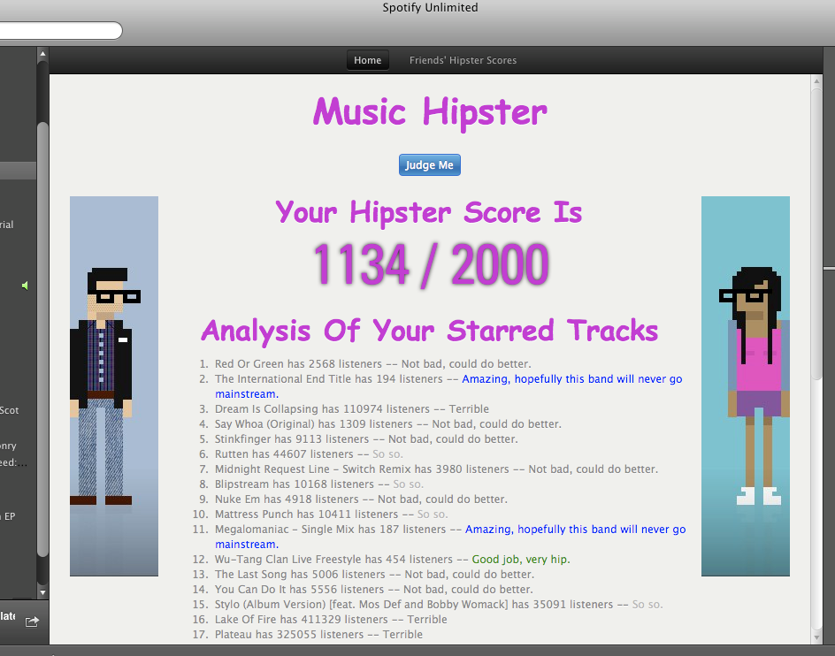

Music Hipster
=============

About
-----

Music Hipster is a Spotify app originally built for a talk at `Edinburgh Techmeetup`_

Use it to see how to do some of the common tasks in Spotify apps, or to get your own Music Hipster Score.

License: MIT (see LICENSE file for details).

Screenshot
----------

Install
-------

Download and unpack into ~/Spotify/MusicHipster, then open Spotify and type "spotify:app:musichipster" into the search bar.

.. _Edinburgh Techmeetup: http://techmeetup.co.uk

